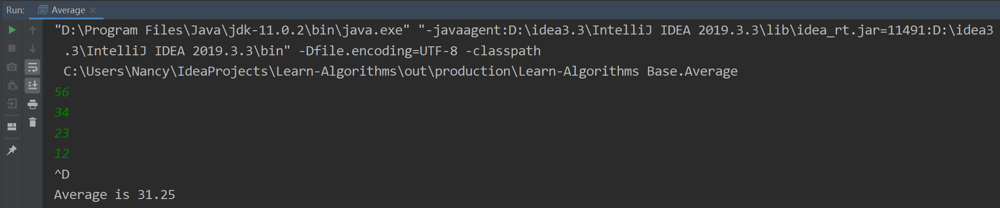
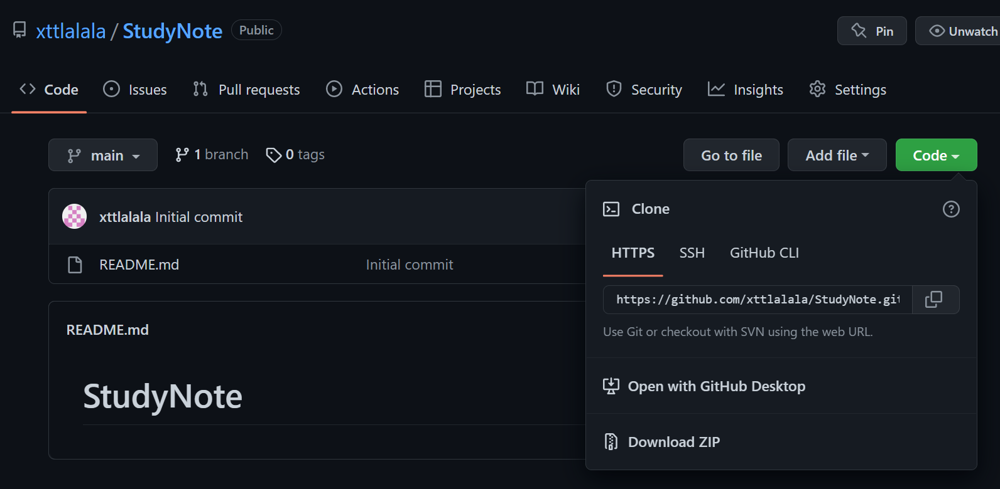
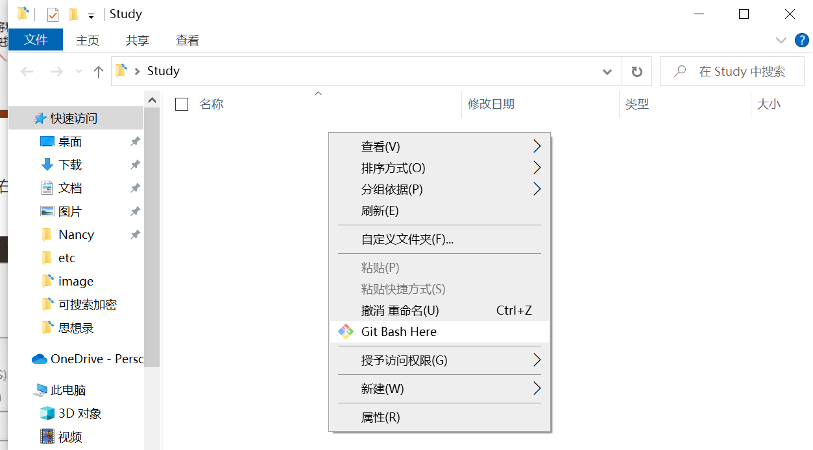
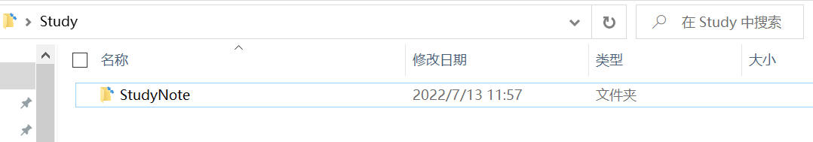
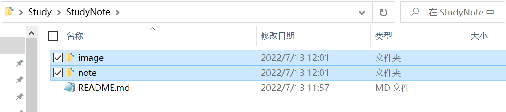
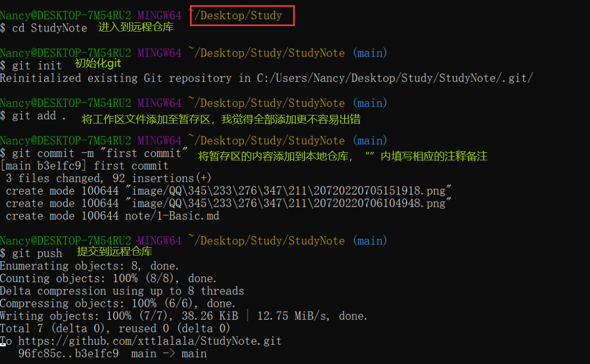
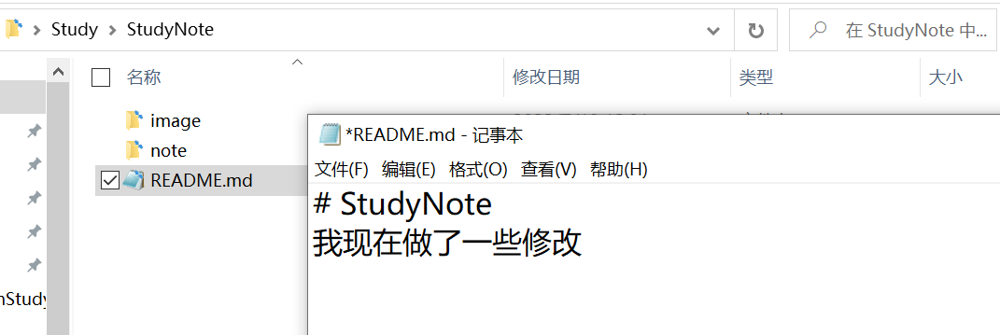
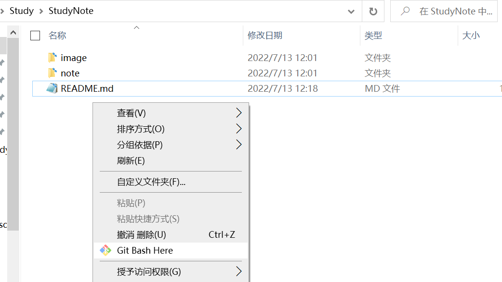
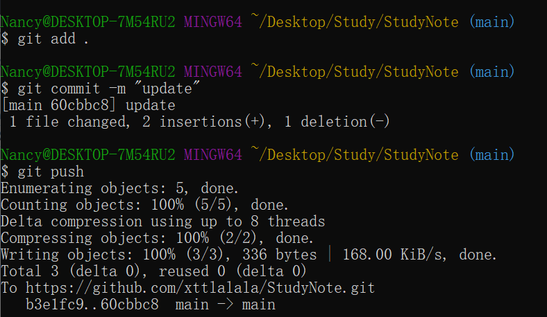
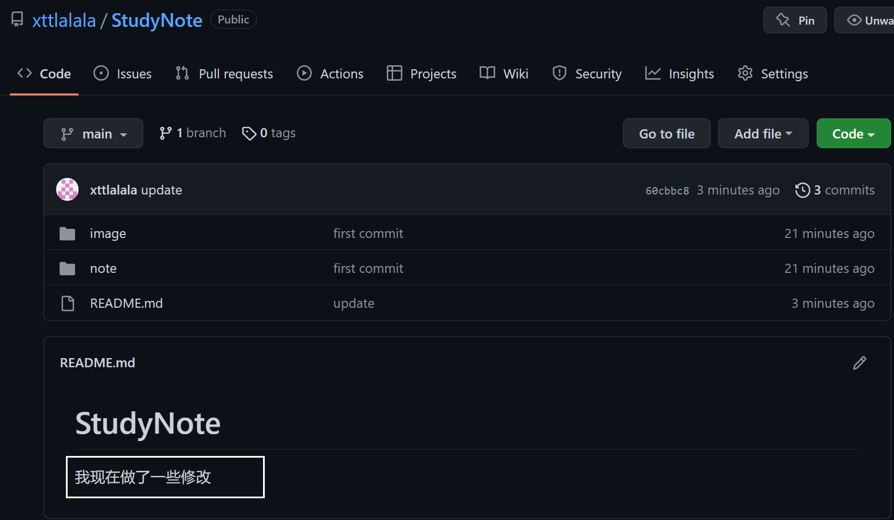

# 第一章 基础

[TOC]

## 1.1基础编程模型

### 基础命令行使用

| 命令  |                  参数                  |     作用     |
| :---: | :------------------------------------: | :----------: |
| javac |             .java文件名称              | 编译java程序 |
| java  | .class文件的名称（不需要扩展名）+ 参数 | 运行java程序 |
| more  |           任意格式文件的名称           | 打印文件内容 |

使用命令行编译一个名为Test.java的程序

```
% javac Test.java
% java Test
```

### 命令行与参数

​	Java类会包含一个静态方法main()，他有一个String数组类型的参数args[]。这个数组的内容就是我们输入的命令行参数，操作系统会将它传递给Java。

使用命令行编译一个有参数的名为Test.java的程序

```
//命令行
% javac Test.java
% java Test 5 100 200
```


````java
public class Test {

    public static void main(String[] args) {
        int N = Integer.parseInt(args[0]);//5
        double lo = Double.parseDouble(args[1]);//100
        double hi = Double.parseDouble(args[2]);//200
        for(int i=0;i<N;i++){
            double x = lo+Math.random()*(hi-lo);
            System.out.println(x);
        }
    }
}
````

### 标准输入

标准输入流最重要的特点是这些值会在你的程序读取他们之后消失。只要程序读取了一个值，他就不能回退并再次读取它。

```java
import Tool.StdIn;
public class Average {
    public static void main(String[] args) {
        double sum = 0.0;
        int cnt = 0;
        while(!StdIn.isEmpty()){
            sum += StdIn.readDouble();
            cnt++;
        }
        double avg = sum/cnt;
        System.out.println("Average is "+avg);
    }
}
```

直接使用idea运行Average



在cmd用命令行运行Average

```
//用例：计算标准输入的数字的平均值
%java Average //运行java程序
3             //键盘输入后，回车
4
5
6
7
<ctrl-z>      //键盘上按ctrl+z
The average is 5.0  // 
```

在idea的Terminal中运行java程序


### 重定向与管道

将标准输出**重定向**到一个文件中:

```
% java RandomSeq 1000 100 200 > data.txt
```


可以使用**重定向**标准输入以使StdIn从文件中（而不是终端应用程序中）读取数据：

```
% java Average < data.txt
```

将一个程序的输出重定向为另一个程序的输入叫做管道：

```
% java RandomSeq 1000 100 200 | java Average
```

### 1.2数据抽象

* API

我们使用应用程序编程接口（API）来说明抽象数据类型的行为。它将列出所有构造函数和实例方法并简要描述他们的功能。

### 1.3背包队列和栈

* 对集合中的对象的表示方式将直接影响各种操作的效率。
* 泛型和迭代
* 链表

#### 1.3.1  泛型

在每份API中，类名后的<Item>记号将Item定义为一个类型参数，表示的是用例将会使用的具体数据类型。在创建栈时，用例会提供一种具体的数据类型，我们可以将Item替换为任意引用数据类型。

#### 1.3.2 API

泛型可迭代的基础集合数据结构类型的API

| 背包：一种不支持从中删除元素的集合数据类型，迭代的顺序不确定且与用例无关。 |
| ------------------------------------------------------------ |
| pulibc class Bag<Item> implements Iterable<Item>             |
| Bag()                              创建一个空背包            |
| void         add(Item item)               添加一个元素       |
| boolean   isEmpty()                        背包是否为空      |
| int             size()                               背包中的元素数量 |

| 先进先出（FIFO）队列：一种基于先进先出策略的集合类型。保存集合元素相对位置，使他们入队顺序与出对顺序相同。 |
| ------------------------------------------------------------ |
| public class Queue<Item> implements Iterable<Item>           |
| Queue()                              创建空队列              |
| void          enqueue(Item item)           添加一个元素      |
| Item          dequeue()                           删除最早添加的元素 |
| boolean    isEmpty()                            队列是否为空 |
| int              size()                                   队列中的元素数量 |

| 下压栈：一种基于后进先出策略的集合类型。                     |
| ------------------------------------------------------------ |
| public class Stack<Item> implements Iterable<Item>           |
| Stack()                             创建一个空栈             |
| void             push(Item item)               添加一个元素  |
| Item             pop()                                 删除最近添加的元素 |
| boolean       isEmpty()                          栈是否为空  |
| int                 size()                                 栈中的元素数量 |

#### 1.3.3 自动装箱

类型参数必须被实例化为**引用类型**，因此Java有一种特殊机制来使泛型代码能够处理原始数据类型。在处理赋值语句、方法的参数和算术或逻辑表达式时，Java对自动在引用类型和对应的原始数据类型之间进行转换。

````java
Stack<Integer> stack = new Stack<Integer>();
stack.push(12);               //自动装箱（int=>Integer）
int i = stack.pop();          //自动拆箱（Integer=>int）
````

#### 1.3.4 双栈算术表达式求值算法

````java
import Tool.StdIn;
import java.util.Stack;
public class Evaluate {
    public static void main(String[] args) {
        Stack<String> ops = new Stack<String>();
        Stack<Double> vals = new Stack<Double>();
        while(!StdIn.isEmpty()){          //读取字符
            String s = StdIn.readString();//如果是运算符则压入运算符栈
            if(s.equals("("))             //如果遇到“(”,则忽略
                ;
            else if(s.equals("+"))
                ops.push(s);
            else if(s.equals("-"))
                ops.push(s);
            else if(s.equals("*"))
                ops.push(s);
            else if(s.equals("/"))
                ops.push(s);
            else if(s.equals("sqrt"))
                ops.push(s);
            else if(s.equals(")")){        //如果字符为“）”，弹出运算符和操作数，计算结果并压入栈
                String op = ops.pop();
                double v = vals.pop();
                if(op.equals("+"))
                    v = vals.pop() + v;
                else if(op.equals("-"))
                    v = vals.pop() - v;
                else if(op.equals("*"))
                    v = vals.pop() * v;
                else if(op.equals("/"))
                    v = vals.pop() / v;
                else if(op.equals("sqrt"))
                    v = Math.sqrt(v);
                vals.push(v);
            }
            //如果不是运算符和括号，则压入操作数栈
            else vals.push(Double.parseDouble(s));
        }
        System.out.println(vals.pop());
    }
}
````


------


## 补充：

### 1.初次将文件夹上传到github中

**需求：将note文件夹和image文件夹上传到github上**

1. 在github上创建一个名为StudyNote仓库,并复制仓库地址



2. 本地创建一个Study的空文件夹



3. 系统弹出git bash框，输入代码

```bash
$ git clone https://github.com/xttlalala/StudyNote.git
```



在github上创建的库以文件夹的形式（StudyNote）落在Study目录中

4. 将note文件夹和image文件夹复制到StudyNote中



5. 回到git bash界面，输入以下代码：

```bash
$ cd StudyNote
$ git init
$ git add .
$ git commit -m "first-commit"
$ git push
```



本地文件夹即可上传到github仓库中。

### 2.修改后再次提交

1. 我对readme.md文件进行了修改



2. 也可以直接在StudyNote文件夹中进入git bash



3. 在git bash中输入命令

```bash
$ git add .
$ git commit -m "update"
$ git push
```




4. 成功同步到github仓库


