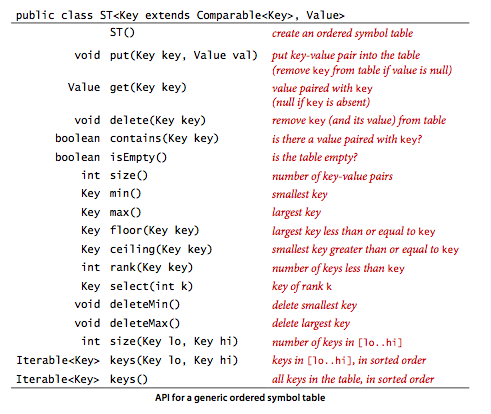

# 第三章 查找

[TOC] 

## 3.1符号表

> **定义。** 符号表是一种存储键值对的数据结构，支持两种操作：**插入(put)** ，即将一组新的键值对存入表中；**查找(get)** ，即根据给定的键得到相应的值。

### 3.1.1API


#### 3.1.1.1泛型

和排序一样，在设计方法时我们没有指定处理对象的类型，而是使用了泛型。对于符号表，我们通过明确地指定查找时键和值来区分他们不同的角色。

#### 3.1.1.2重复的键

符号表的实现遵循以下规则：

* 每个键只对应一个值（表中不允许存在重复的键）
* 当用例代码向表中存入的键值对和表中已有的键冲突时，新的值会替代旧的值。

#### 3.1.1.3迭代

​		为了方便用例处理表中的所有键值，我们有时会在API的第一行加上`implements Iterable<Key>`这句话，强制所有实现都必须包含 iterator( ) 方法来返回一个实现了`hasNext()`和` next()` 方法的迭代器。   

​		我们定义了 keys() 方法来返回一个 Iterable<Key> 对象以方便用例遍历所有的键。

### 3.1.2有序符号表

​	在典型应用中，键是`Comparable`对象，因此存在使用代码`a.compareTo(b)` 比较两个键`a`和`b`的选项。许多符号表实现都利用了`Comparable`接口带来的间的有序性更好的实现put()`和`get()`操作。



### 3.1.3无序链表的顺序查找

```java
package Search;
public class SequentialSearchST<Key,Value> {
    private class Node{
        Key key;
        Value val;
        Node next;
        public Node(Key key, Value val, Node next){
            this.key = key;
            this.val = val;
            this.next = next;
        }
    }
    private Node first;
    public void put(Key k,Value v){
        for(Node n = first;n!=null;n=n.next){
            if(k.equals(n.key)){
                n.val = v;
                return;
            }
        }
        first = new Node(k,v,first);
    }
    public Value get(Key k){
        for(Node n = first;n!=null;n=n.next){
            if(k.equals(n.key)){
                return n.val;
            }
        }
        return null;
    }
    public int size(){
        int n=0;
        Node x = first;
        while(x!=null){
            n++;
            x = x.next;
        }
        return n;
    }
    public void delete(Key k){
        if(first.key.equals(k)) {
            first.key = null;
            first.val = null;
            first = first.next;
            return;
        }
        Node x = first;
        while(x.next!=null){
            if(x.next.key.equals(k)){
                x.next.key=null;
                x.next.val=null;
                x.next = x.next.next;
            }
            x = x.next;
        }

    }
}
```

> **命题A。** 在含有N对键值的基于（无序）链表的符号表中，未命中的查找和插入操作都需要N次比较。命中的查找在最坏情况下需要N次比较。特别地，向一个空表中插入N个不同的键需要~N²/2次比较。

### 3.1.4有序数组中的二分查找

